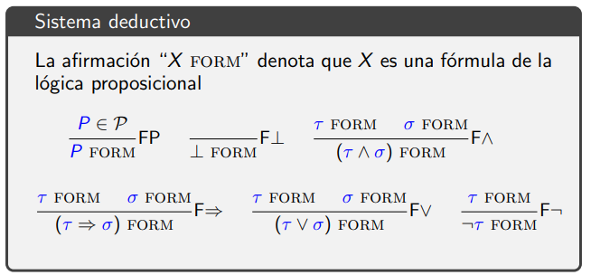

# Ejercicios de la clase de Sistemas Deductivos  

## I.  
Demostrar ¬(P ⇒ (Q ⇒ P)) FORM.
```
          -----FQ ------FP
          Q FORM  P FORM
------FP -------------- F⇒
P FORM   (Q ⇒ P) FORM
---------------------- F⇒
(P ⇒ (Q ⇒ P)) FORM
--------------- F¬
¬(P ⇒ (Q ⇒ P))
```
## I. Conjuncion.  
Dar derivacion de P ∧ Q ⊢ Q ∧ P.  
```
-------------ax     -------------ax
P ∧ Q ⊢ P ∧ Q       P ∧ Q ⊢ P ∧ Q
--------------∧e2   ----------------∧e2
P ∧ Q ⊢ Q           P ∧ Q ⊢ P
--------------------------------∧i
P ∧ Q ⊢ Q ∧ P
```
## II. Conjuncion.  
Dar una derivación de P ∧ (Q ∧ R) ⊢ (P ∧ Q) ∧ R
```
                              -------------------------ax
                               P ∧ (Q ∧ R) ⊢ P (Q ∧ R)   
-------------------------ax   ----------------------- ∧e2          --------------------------ax
P ∧ (Q ∧ R) ⊢ P ∧ (Q ∧ R)     P ∧ (Q ∧ R) ⊢ (Q ∧ R)                P ∧ (Q ∧ R) ⊢ P ∧ (Q ∧ R)
-------------------------∧e1  ---------------------∧e1             -----------------------∧e2                                   
P ∧ (Q ∧ R) ⊢ P               P ∧ (Q ∧ R) ⊢ Q                      P ∧ (Q ∧ R) ⊢ (Q ∧ R)
---------------------------------------------∧i                    ---------------------∧e2
P ∧ (Q ∧ R) ⊢ (P ∧ Q)                                              P ∧ (Q ∧ R) ⊢ R
------------------------------------------------------------------------------ ∧i
P ∧ (Q ∧ R) ⊢ (P ∧ Q) ∧ R
```
## I. Implicacion.  
Dar una derivación de ⊢ P ⇒ P
```
------ax
P ⊢ P
---------⇒i
⊢ P ⇒ P
```
## II. Implicacion.  
Dar una derivación de ⊢ P ⇒ Q ⇒ (Q ∧ P)  
```
---------ax     --------ax
P, Q ⊢ Q        P, Q ⊢ P
-----------------------------∧i
P, Q ⊢ (Q ∧ P)
-----------------------------⇒i
P ⊢ (Q ⇒ (Q ∧ P)) 
-----------------------------⇒i
⊢ P ⇒ (Q ⇒ (Q ∧ P)) 
```
## III. Implicacion.  ???
Dar una derivación de P ⇒ Q, Q ⇒ R ⊢ P ⇒ R
```

------------------------       ---------------------ax
P ⇒ Q, Q ⇒ R, P ⊢ P ⇒ R       P ⇒ Q, Q ⇒ R, P ⊢ P
------------------------------------------------------------⇒e
P ⇒ Q, Q ⇒ R, P ⊢ R
------------------------------------------------------------⇒i
P ⇒ Q, Q ⇒ R ⊢ P ⇒ R
```
## I. Disyunción.
Dar una derivación de ⊢ P ⇒ (P ∨ P)
```
-----ax   
P ⊢ P      
-----------------Vi1 
P ⊢ (P ∨ P)     
-----------------⇒i
⊢ P ⇒ (P ∨ P)
```
## II. Disyunción.
Dar una derivacióon de ⊢ (P ∨ P) ⇒ P
```
---------------ax         ---------------ax      ---------------ax
(P ∨ P) ⊢ P V P           (P ∨ P), P ⊢ P         (P V P), P ⊢ P
------------------------------------------------------------------Ve
(P ∨ P) ⊢ P
-----------------⇒i
⊢ (P ∨ P) ⇒ P
```
## III. Disyunción.  
Dar una derivación de P ∨ Q ⊢ Q ∨ P
```
                  -------------ax      -------------ax
                  P ∨ Q, P ⊢ P         P ∨ Q, Q ⊢ Q
-------------ax   ----------------Vi2  -------------------Vi1
P ∨ Q ⊢ P V Q     P ∨ Q, P ⊢ Q V P     P ∨ Q, Q ⊢ Q V P
-----------------------------------------------------------Ve
P ∨ Q ⊢ Q ∨ P
```
## I. Falsedad.  ??
Dar una derivación de (P ∨ Q) ⇒ ⊥ ⊢ P ⇒ Q
```
---------ax
Γ, ⊥ ⊢ ⊥
----------⇒i
Γ ⊢ ⊥ => ⊥         Γ ⊢ ⊥
------------------------------⇒e sea Γ:= (P ∨ Q) ⇒ ⊥, P
(P ∨ Q) ⇒ ⊥, P ⊢ ⊥
-----------------------⊥e
(P ∨ Q) ⇒ ⊥, P ⊢ Q 
-----------------------⇒i
(P ∨ Q) ⇒ ⊥ ⊢ P ⇒ Q
```
## II. Falsedad.  
Dar una derivación de (P ∧ Q) ⇒ ⊥ ⊢ P ⇒ Q ⇒ R
```
(P ∧ Q) ⇒ ⊥ ⊢ P ⇒ Q ⇒ R
```
